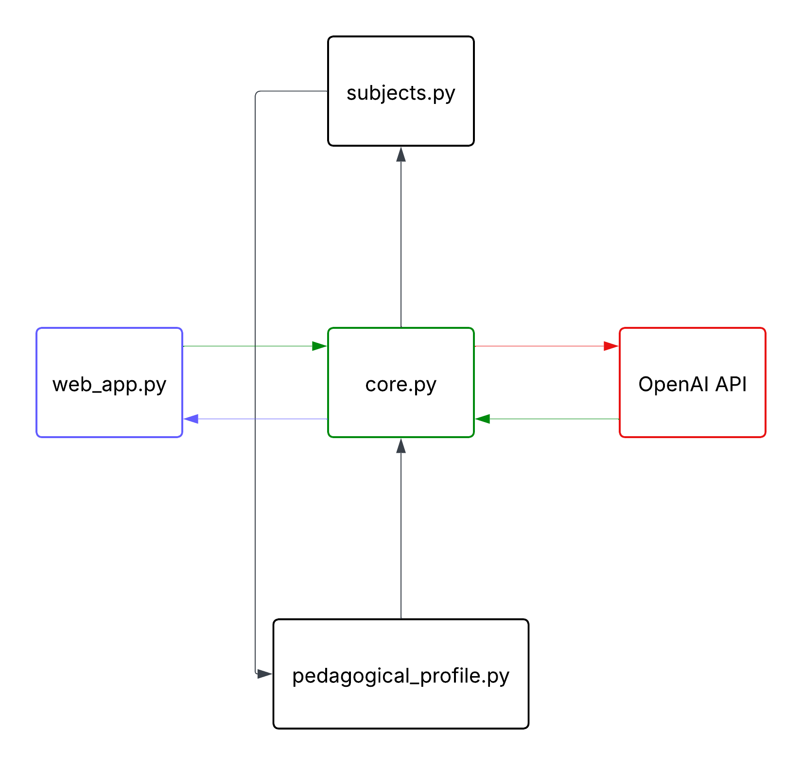

# Math AI Tutor

[]()
[]()
[]()
[]()

Aplicação educativa baseada em inteligência artificial para apoio ao ensino de Matemática e Física, utilizando a API da OpenAI. A aplicação oferece suporte pedagógico personalizado com base em perfis educacionais e temas específicos.

Aplicação disponível em produção em:

https://math-tutor-ai.streamlit.app/

## Estrutura da Aplicação

A arquitetura da aplicação é construída em módulos independentes que interagem por meio do núcleo (`core.py`). 

Abaixo está o diagrama da arquitetura:



### Principais Módulos

- **core.py**  
  Responsável por integrar os módulos, processar as mensagens e controlar as interações com a API da OpenAI.

- **web_app.py**  
  Interface web desenvolvida em Streamlit, responsável por receber mensagens do usuário e exibir as respostas no navegador.

- **subjects.py**  
  Define os temas e campos de atuação da tutoria (Matemática, Física, etc.), indicando como cada tipo de pergunta deve ser tratado.

- **pedagogical_profile.py**  
  Define o perfil pedagógico, com regras de comunicação, uso de LaTeX e estilo de explicação.

- **cli_chat.py**  
  Interface de linha de comando para testes e interações rápidas no terminal.

- **config_example.py**  
  Exemplo de arquivo de configuração para variáveis como chave da API e nome do modelo.

## Requisitos

Os pacotes necessários estão listados no arquivo `requirements.txt`. Instale com:

```bash
pip install -r requirements.txt
```

## Variáveis de Ambiente

Crie um arquivo `.env` na raiz do projeto com o seguinte conteúdo:

```bash
OPENAI_API_KEY=your_api_key_here
```

Em produção (por exemplo, no Streamlit Cloud), defina a variável de ambiente `OPENAI_API_KEY` diretamente nas configurações da plataforma.

## Execução da Aplicação

### Via interface web (Streamlit)

Para rodar localmente:

```bash
streamlit run app/web_app.py
```

A aplicação será aberta no navegador padrão, permitindo conversar com o tutor.

### Via terminal (CLI)

Para testar o tutor no terminal:

```bash
python -m app.cli_chat
```

## Fluxo de Funcionamento

1. O usuário envia uma mensagem pela interface (web ou terminal).
2. O `core.py` recebe a mensagem e aplica o perfil pedagógico definido em `pedagogical_profile.py`.
3. A mensagem é enriquecida com informações de tema via `subjects.py`.
4. O conteúdo é enviado para a API da OpenAI por meio do cliente configurado.
5. A resposta é registrada em logs e devolvida ao usuário conforme as regras pedagógicas.

## Observações Importantes

- A aplicação não utiliza emojis nas respostas.
- O sistema foi desenvolvido para estudantes do Ensino Médio e início de graduação.
- O código está preparado para futuras expansões com novos módulos, ajustes de perfil pedagógico ou inclusão de outros temas.

## Autor

Desenvolvido por **Axl Andrade**.

---

Para expandir as funcionalidades ou incluir novos temas, recomenda-se começar editando os arquivos `subjects.py` e `pedagogical_profile.py`.