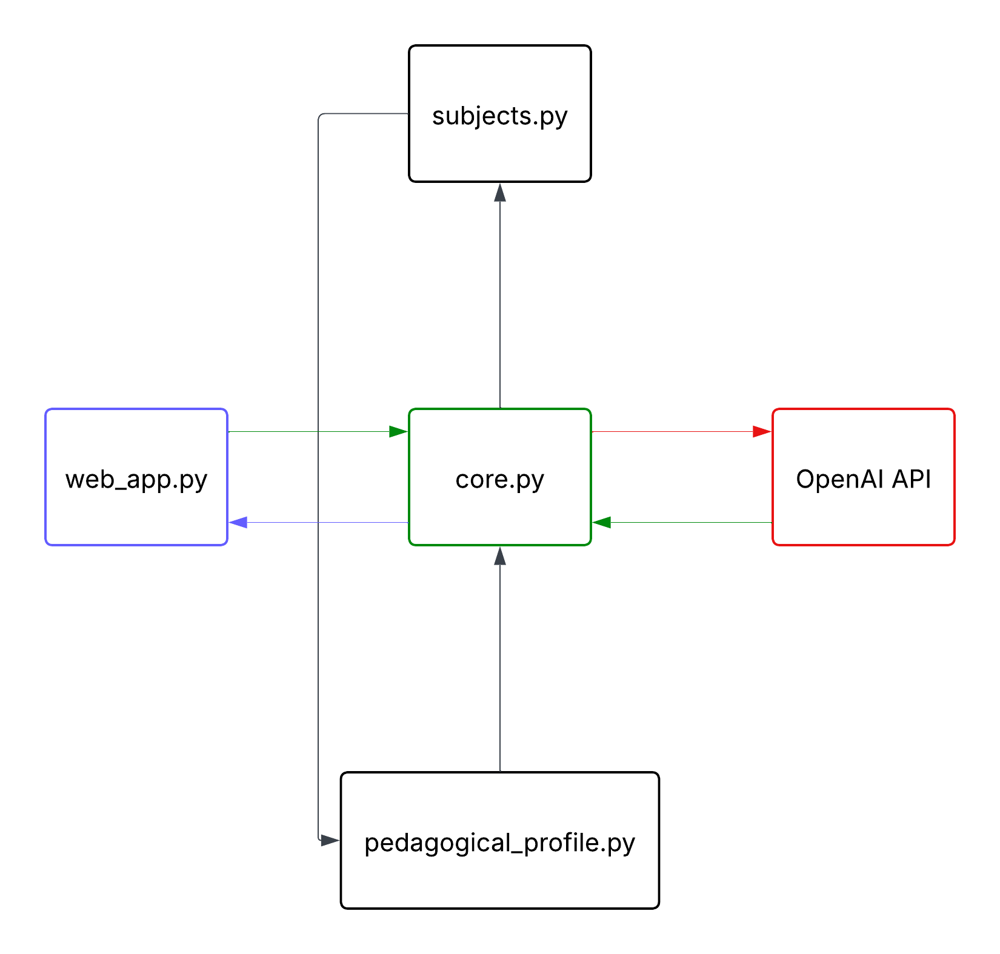

# Math AI Tutor

[]()
[]()
[]()
[](LICENSE)

Tutor educacional de Matemática e Física com interface web em Streamlit, integração com a
API da OpenAI, memória curta de conversa e respostas orientadas por um perfil pedagógico.

O projeto foi pensado para apoiar estudantes do Ensino Médio e do início da graduação com
explicações estruturadas, uso adequado de LaTeX e atenção especial a unidades, interpretação
conceitual e passos de resolução.

**Aplicação em produção:** https://math-tutor-ai.streamlit.app/

## Destaques

- Interface web simples e responsiva construída com Streamlit.
- CLI para testes rápidos e uso local no terminal.
- Detecção heurística de tema para adaptar o prompt a Matemática, Física ou perguntas genéricas.
- Prompt pedagógico centralizado, com regras de explicação, escopo e formatação matemática.
- Memória configurável para manter contexto recente da conversa.
- Logs locais em JSONL para auditoria, depuração e evolução do tutor.
- Configuração por `.env`, com modelo e diretório de logs ajustáveis por ambiente.

## Arquitetura



| Arquivo | Responsabilidade |
| --- | --- |
| `core.py` | Orquestra cliente OpenAI, prompt de sistema, memória, modelo e logs. |
| `web_app.py` | Implementa a experiência web em Streamlit. |
| `cli_chat.py` | Expõe uma interface de linha de comando para conversas locais. |
| `subjects.py` | Detecta o tema da pergunta e constrói instruções específicas por área. |
| `pedagogical_profile.py` | Define o perfil pedagógico e as regras de resposta do tutor. |
| `tests/` | Garante comportamento básico de tema, prompt, memória e persistência de logs. |

## Requisitos

- Python 3.10 ou superior.
- Uma chave válida da API da OpenAI.

## Configuração Local

Crie e ative um ambiente virtual:

```bash
python -m venv .venv
source .venv/bin/activate
```

Instale o projeto com dependências de desenvolvimento:

```bash
python -m pip install --upgrade pip
python -m pip install -e ".[dev]"
```

Crie seu arquivo de ambiente:

```bash
cp .env.example .env
```

Preencha as variáveis:

```bash
OPENAI_API_KEY=your_api_key_here
OPENAI_MODEL=gpt-4.1-nano
LOGS_DIR=logs
```

## Como Rodar

Interface web:

```bash
streamlit run web_app.py
```

Interface de terminal:

```bash
math-ai-tutor
```

Execução direta alternativa:

```bash
python cli_chat.py
```

## Qualidade

Antes de publicar alterações, rode:

```bash
ruff check .
pytest
```

Os testes cobrem:

- classificação de perguntas por tema;
- composição do prompt de sistema;
- recorte da memória de conversa;
- gravação de logs em JSONL;
- seleção de modelo por variável de ambiente.

## Variáveis de Ambiente

| Variável | Obrigatória | Padrão | Descrição |
| --- | --- | --- | --- |
| `OPENAI_API_KEY` | Sim | - | Chave usada para autenticar na API da OpenAI. |
| `OPENAI_MODEL` | Não | `gpt-4.1-nano` | Modelo usado para gerar respostas. |
| `LOGS_DIR` | Não | `logs` | Diretório onde os arquivos JSONL são salvos. |

## Logs e Privacidade

As interações são salvas em `logs/chat_log_YYYY-MM-DD.jsonl` com timestamp, tema detectado,
origem da conversa, mensagens enviadas ao modelo e resposta gerada.

O diretório `logs/` e o arquivo `.env` não devem ser versionados. Evite registrar dados
pessoais, sensíveis ou identificáveis durante testes e demonstrações.

## Estrutura de Desenvolvimento

O repositório usa `pyproject.toml` como ponto central de configuração para pacote,
dependências, lint e testes. O script `math-ai-tutor` é registrado como entrypoint da CLI
quando o projeto é instalado em modo editável.

Para expandir o tutor, os pontos de entrada mais importantes são:

- `subjects.py`, para ampliar a detecção de áreas e temas;
- `pedagogical_profile.py`, para ajustar tom, escopo e regras pedagógicas;
- `core.py`, para alterar modelo, memória, logs ou integração com a API;
- `web_app.py`, para evoluir a experiência de usuário no Streamlit.

## Licença

Distribuído sob a licença MIT. Veja [LICENSE](LICENSE).

## Autor

Desenvolvido por **Axl Andrade**.
